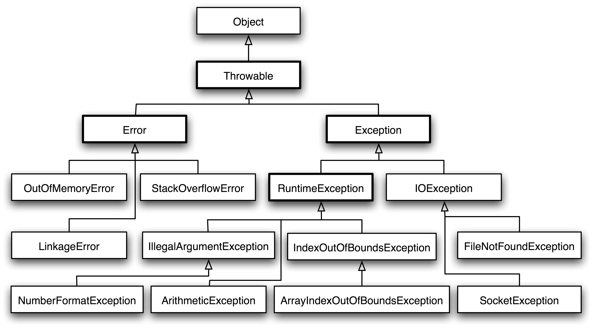

# Spring Boot Exception Handling

## Java Exception hierarchy in Java



## How to build?

**How to run in Gitpod:**

[](https://gitpod.io/#https://github.com/jabrena/spring-boot-exception-handling)

**How to run in local:**

```
java -version
sdk env
mvn clean test -pl example-ok
```

## Links

```
http://localhost:8080/swagger-ui/index.html
```
